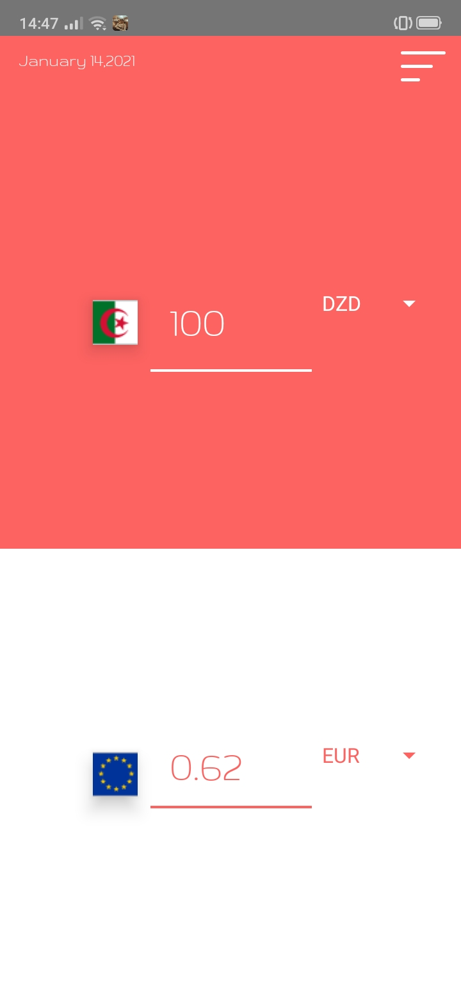

# Currency Converter

A currency converter is used to convert an amount in one currency to its corresponding value in another currency using their current exchange rate, for example it can be used to calculate the value of 100 US Dollars in Euros. Current exchange rates are usually provided by banks and other financial service providers, they also (in some cases) offer free and paid APIs for developers to get current and historical exchange rates between two or more currencies.

## current progress :

## final vision :

## User Stories

- [ ] User can enter up to 9 digits to represent the amount to convert in a source input field
- [ ] User can view a sorted list of available currencies and select the currency to convert from in a source drop-down list
- [ ] User can view a sorted list of available currencies and select the currency to convert to in a destination drop-down list
- [ ] User views the value (rounded to two decimal places) of the source amount converted to the destination currency in a single output field as soon as either the input value, the source currency, or the destination currency is changed.
- [ ] User must be alerted if the input is not a number

## Bonus features

- [ ] User should be able to swap the values of the source and destination drop-down lists on the click of a button

## ------------------

- free open source Made with ❤ in Algeria  
  by : <a href= 'https://www.linkedin.com/in/ilies-ould-menouer-6a02111a2/' >ilies Ouldmenouer</a>
